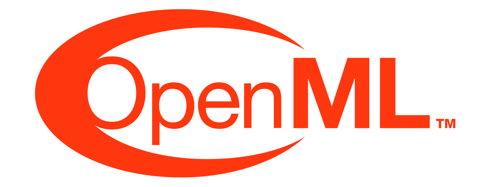

<h1>Hi 👋, I'm Mohamed Mohamed Ibrahim</h1>

A passionate Software and ML Engineer from Alexandria, Egypt. 

<!-- For dopmine purpose - please do not remove in future -->
<!--  -->

# Projects 🚀

- [Wordle-Solver](https://github.com/Mohamed-Mohamed-Ibrahim/Wordle-Solver) - Private 
- [CUDA-Matrix-Multiplication-CPU-vs-GPU](https://github.com/Mohamed-Mohamed-Ibrahim/CUDA-Matrix-Multiplication-CPU-vs-GPU) - Private 
- [Depth-Estimation](https://github.com/mohassan5286/CV-Lab-3) - Private 
- [Cartoonifying-and-Lane-Road-Detector](https://github.com/Mohamed-Mohamed-Ibrahim/CV-lab-1) - Private 
- [Augmented-Reality-and-Image-Mosaics](https://github.com/Mohamed-Mohamed-Ibrahim/Augmented-Reality-and-Image-Mosaics)
- [Code-Generation-and-Guarding](https://github.com/Mohamed-Mohamed-Ibrahim/Code-Generation-and-Guarding) - Private 
- [French-to-English-NMT](https://github.com/Mohamed-Mohamed-Ibrahim/French-to-English-NMT) 
- [Named-Entity-Recognition](https://github.com/Mohamed-Mohamed-Ibrahim/Named-Entity-Recognition)
- [N-Gram-Language-Model-and-Text-Classification](https://github.com/Mohamed-Mohamed-Ibrahim/NLP-lab-1) - Private 
- [Compiler](https://github.com/Mohamed-Mohamed-Ibrahim/Compiler) - Private 
- [PDF-Q&A-Bot](https://github.com/Mohamed-Mohamed-Ibrahim/PDF-QA-Bot) - Private 
- [Agricultural-Land-Classification](https://github.com/Mohamed-Mohamed-Ibrahim/Agricultural-Land-Classification) - Private 
- [Waste-Classification](https://github.com/Mohamed-Mohamed-Ibrahim/Agricultural-Land-Classification) - Private 
- [Virtual-Bank-System](https://github.com/Mohamed-Mohamed-Ibrahim/Virtual-Bank-System)
- [Weather-Stations-Monitor](https://github.com/Mohamed-Mohamed-Ibrahim/Weather-Stations-Monitor)
- [PaintIt](https://github.com/Mohamed-Mohamed-Ibrahim/PaintIt)
- [PathPort](https://github.com/Mohamed-Mohamed-Ibrahim/PathPort)
- [Smart-City-Parking-Management-System](https://github.com/Mohamed-Mohamed-Ibrahim/Smart-City-Parking-Management-System)
- [Signal-Flow-Graph](https://github.com/Mohamed-Mohamed-Ibrahim/Signal-Flow-Graph) 
<!-- -   -->

 

  
<b>Older Projects 🏛️</b>
  
   
   - [Sudoku-Solver-CSP](https://github.com/Mohamed-Mohamed-Ibrahim/CSP-Sudoko)
   - [Connect-4-MiniMax](https://github.com/Mohamed-Mohamed-Ibrahim/Connect-4-AI)
   - [8-Puzzle-Search-AI](https://github.com/Mohamed-Mohamed-Ibrahim/8-Puzzle-AI)
   - [Socket-Programming](https://github.com/Mohamed-Mohamed-Ibrahim/Socket-Programming)
   - [Diamond-Project](https://github.com/Mohamed-Mohamed-Ibrahim/Diamond-Project)
   - [Music-Classifier](https://github.com/Mohamed-Mohamed-Ibrahim/Music-Classifier)
   - [Salary-Dashboard](https://github.com/Mohamed-Mohamed-Ibrahim/Salary-Dashboard)
   - [Root finder](https://github.com/Mohamed-Mohamed-Ibrahim/Root-Finder)
   - [Connect-4](https://github.com/Mohamed-Mohamed-Ibrahim/Connect-4)

  

<!-- 

  
<b>Top 5 Favorite Projects 🥰</b>

   
  <ul>
    <li><b>NLP:</b> <a href="https://github.com/Mohamed-Mohamed-Ibrahim/French-to-English-NMT">French-to-English-NMT</a></li>
    <li><b>AI:</b> <a href="https://github.com/Mohamed-Mohamed-Ibrahim/Diamond-Project">Diamond-Project</a></li>
    <li><b>Data Engineering:</b> <a href="https://github.com/Mohamed-Mohamed-Ibrahim/Weather-Stations-Monitor">Weather-Stations-Monitor</a></li>
    <li><b>Web Development:</b> <a href="https://github.com/Mohamed-Mohamed-Ibrahim/PathPort">PathPort</a></li>
    <li><b>Software Development:</b> <a href="https://github.com/Mohamed-Mohamed-Ibrahim/Connect-4">Connect-4</a></li>
  </ul>

   -->

   
<b>Categorized by Fields 🗂️</b>

- Web Development
   - [Virtual-Bank-System](https://github.com/Mohamed-Mohamed-Ibrahim/Virtual-Bank-System)
   - [PaintIt](https://github.com/Mohamed-Mohamed-Ibrahim/PaintIt)
   - [PathPort](https://github.com/Mohamed-Mohamed-Ibrahim/PathPort)
   - [Smart-City-Parking-Management-System](https://github.com/Mohamed-Mohamed-Ibrahim/Smart-City-Parking-Management-System)
   - [Signal-Flow-Graph](https://github.com/Mohamed-Mohamed-Ibrahim/Signal-Flow-Graph)

- AI & Data Science
   - [Environmental-Sound-Classification](https://github.com/Mohamed-Mohamed-Ibrahim/Environmental-Sound-Classification)
   - [Speech-Emotion-Recognition](https://github.com/Mohamed-Mohamed-Ibrahim/Speech-Emotion-Recognition)
   - [Face-Recognition](https://github.com/Mohamed-Mohamed-Ibrahim/Face-Recognition)
   - [Heart-Failure-Classifier](https://github.com/Mohamed-Mohamed-Ibrahim/Heart-Failure-Classifier)
   - [Diamond-Project](https://github.com/Mohamed-Mohamed-Ibrahim/Diamond-Project)
   - [Music-Classifier](https://github.com/Mohamed-Mohamed-Ibrahim/Music-Classifier)
   - [Salary-Dashboard](https://github.com/Mohamed-Mohamed-Ibrahim/Salary-Dashboard)
   - [Sudoku-Solver-CSP](https://github.com/Mohamed-Mohamed-Ibrahim/CSP-Sudoko)
   - [Connect-4-MiniMax](https://github.com/Mohamed-Mohamed-Ibrahim/Connect-4-AI)
   - [8-Puzzle-Search-AI](https://github.com/Mohamed-Mohamed-Ibrahim/8-Puzzle-AI)

- Computer Vision
   - [Object-Detection-Models-Comparison](https://github.com/Mohamed-Mohamed-Ibrahim/Object-Detection-Models-Comparison)
   - [Augmented-Reality-and-Image-Mosaics](https://github.com/Mohamed-Mohamed-Ibrahim/Augmented-Reality-and-Image-Mosaics)

- NLP
   - [French-to-English-NMT](https://github.com/Mohamed-Mohamed-Ibrahim/French-to-English-NMT)
   - [Named-Entity-Recognition](https://github.com/Mohamed-Mohamed-Ibrahim/Named-Entity-Recognition)

- Data Engineering
   - [Weather-Stations-Monitor](https://github.com/Mohamed-Mohamed-Ibrahim/Weather-Stations-Monitor)

- Software Development
   - [Root finder](https://github.com/Mohamed-Mohamed-Ibrahim/Root-Finder)
   - [Connect-4](https://github.com/Mohamed-Mohamed-Ibrahim/Connect-4)

- Networks
   - [Socket-Programming](https://github.com/Mohamed-Mohamed-Ibrahim/Socket-Programming)

   

# Languages and Tools I Use 🛠️
### Core Languages

### Graphics & Parallel Computing

### AI, Machine Learning & Data Engineering

### Web Development & Backends

### DevOps & Infrastructure

# Where to find me ⚡️

  
  
  
  

    
    

 

    
Github Status

    

    
    

    

    

    

